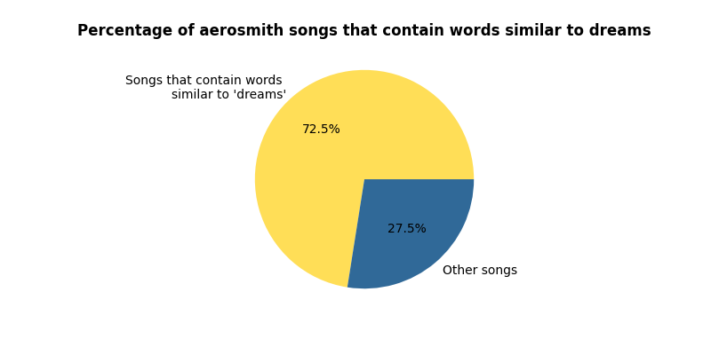

# Assignment 3: Query expansion with word embeddings


## About

This project performs query expansion on a target word using word embeddings from the genism ``glove-wiki-gigaword-50`` to search for songs in the ``Spotify Million Song Dataset``. The script searches for both the target word and the ten most similar words related to it. You can choose the artist and the word you want to search for by adding them as an argparse argument. 

The ``src`` directory contains one script: 

- **query_expansion.py:** Filters the Spotify dataset based on the artist, performs query expansion on the target word,  searches for the words related to it in the dataset, and saves the results as a plot and a csv in the ``out`` directory. 


### Data

Download the dataset used for this project [here](https://www.kaggle.com/datasets/joebeachcapital/57651-spotify-songs), unzip the folder and place the ``Spotify Million Song Dataset_exported.csv`` in the ``in`` directory.

### Model

This project uses the [glove-wiki-gigaword-50](https://huggingface.co/fse/glove-wiki-gigaword-50) model from gensim to produce word embeddings used for the query expansion, which you can access through the gensim.downloader API as follows:

```sh
import gensim.downloader as api

# Loads the the gensim model
model = api.load("glove-wiki-gigaword-50")
```
It also uses the English [en_core_web_md](https://spacy.io/models/en) pipeline from spaCy to tokenize the text column which contains the song lyrics.

```sh
import spacy

# Loads the spaCy pipeline
nlp = spacy.load("en_core_web_md")
```

##  File Structure

```
└── assignment_3
        |
        |
        ├── in
        │   └── Spotify Million Song Dataset_exported.csv 
        |
        ├── out
        |   ├── {args.artist}_songs_about_{args.word}.csv
        |   └── percentage_of_{args.artist}_songs_about_{args.word}.png
        |
        ├── src
        │   └── query_expansion.py
        │     
        ├── readme.md
        ├── requirements.txt
        ├── run.sh
        └── setup.sh
```

## Usage

If you want to reproduce this project, please follow the steps below. The instructions will help you set up the environment, run the script and explain the available command-line options. 

### Pre-Requisites

*Please make sure to install the following requirements before running the script.*

**Python**: version 3.12.3

### Installation

**1.** Clone the repository using Git.
```sh
git clone https://github.com/trinerye/language_analytics_2024.git 
```

**2.** Change directory to the assignment folder.
```sh
cd assignment_3
```

**3.** Run ``setup.sh`` to create an environment and install the dependencies needed for this project. 

***Important**: this project was built using ``scipy==1.11.0.`` Do not update this package, as newer versions are incompatible with the ``genism==4.3.2`` version.*

```sh
bash setup.sh
```
**4.** Run ``run.sh`` to activate the environment and run the main script. 
  
```sh
bash run.sh
```
```sh
...
# Activate the environment (Unix/macOS)
source ./LA_A3_env/bin/activate

# Run the code
python src/query_expansion.py -w dreams  -a aerosmith 

# Deactivate the environment
deactivate
```

### Command Line Interface  

This project supports the following command-line options to customize the script. 

***Important:** Remember to write the artist's name in quotations if it contains spaces, as argparse will otherwise dismiss the argument as an error.* 

|Flag      |Shorthand|Description                                                 |Type |Required|
|----------|---------|------------------------------------------------------------|-----|--------|
|--artist  |-a       |Specifies the word you want to use for the query exspansion |str  |TRUE    |
|--word    |-w       |Specifies the artist you want to search for                 |str  |TRUE    |


## Results 

In the ``out`` directory, you can find a csv file of the songs by your chosen artist containing the words from the query expansion and a pie chart showing the percentage of the artist’s songs with those words. Since the script creates the csv and plot dynamically, new files are generated each time you change the search word or the artist, allowing you to compare songs across the entire dataset.



*This is an example of the pie chart, showing the percentage of songs by Aerosmith that contains words similar to dreams*

### Limitations

- While the script converts the artist's name and the search word into lowercase to expand the search, it does not consider spelling mistakes. So, you will need to spell things correctly when parsing the command-line arguments; otherwise, errors will occur. 

- Also, the genism glove-wiki-gigaword-50 model has an extensive vocabulary, including  1.2 million words. However, the Spotify Million Song Dataset only contains 643 unique artists, so your choice of artist is relatively limited. 


