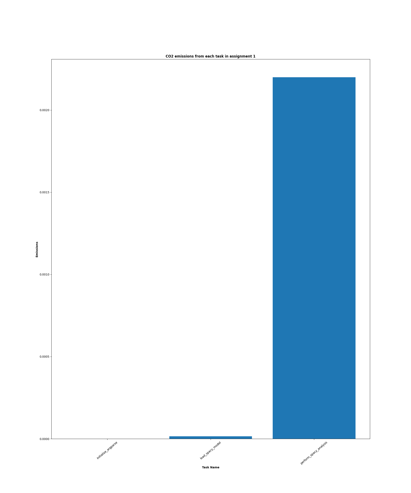
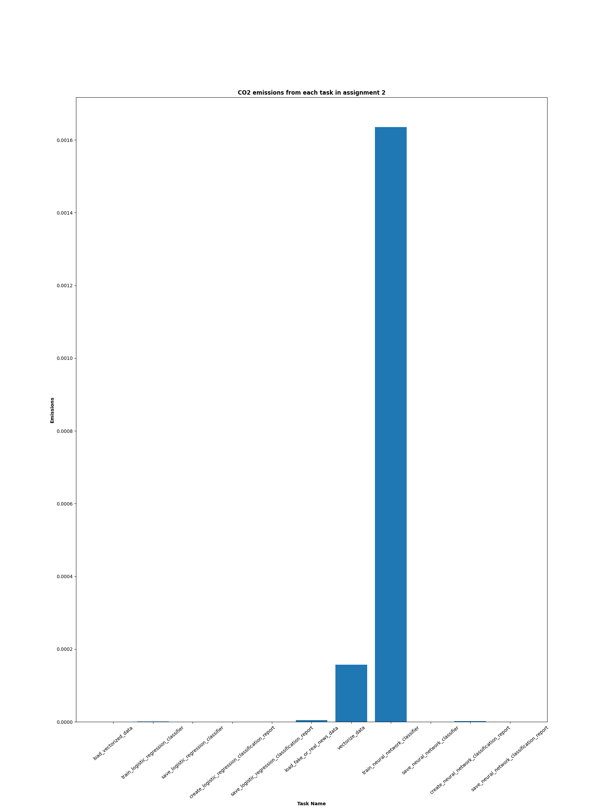

# Assignment 5: Evaluating environmental impact of my exam portfolio


## About

This project tracks the four assignments in this exam portfolio with ``Code Carbon``, evaluating how much CO2 (measured as kilograms of CO₂-equivalent) each assignment emits. The objective is to examine the environmental impact of each assignment and the portfolio as a whole.

The ``src`` directory contains one script: 

- **codecarbon.py:** Loads the emissions files and merges them into one large data frame. It then filters the data frame by project name and creates a new one for each of the four assignments. Based on these, it makes several plots displaying CO2 emissions for each task in the assignments and across all assignments.


### Data

Each of the four portfolio assignments produces the csv files used for this project and places them in the emissions folder. For each assignment Code Carbon initializes an [EmissionsTracker](https://mlco2.github.io/codecarbon/usage.html) object, which tracks each function in the main function and returns the emissions files. *See the approach used in this portfolio down below.*

```sh
from codecarbon import EmissionsTracker

tracker = EmissionsTracker(project_name="emotion_analysis",
                               output_file="emissions.csv",
                               output_dir=emissions_folderpath) 

tracker.start_task("initialize_argparse")

# Function to track

tracker.stop_task()

tracker.stop()

```

##  File Structure

```
└── assignment_5
        |
        |
        ├── emissions
        |   ├── emissions_base_0.csv
        |   ├── emissions_base_1.csv
        |   ├── ...
        │   └── emissions_base_5.csv
        |
        ├── out
        |   ├── all_assignments.png
        |   ├── all_emissions.csv
        |   ├── emotion_analysis.png
        |   ├── linguistic_analysis.png
        |   ├── query_expansion.png
        |   └── text_classification.png
        |
        ├── src
        │   └── codecarbon.py
        │     
        ├── readme.md
        ├── requirements.txt
        ├── run.sh
        └── setup.sh

```

## Usage

If you want to reproduce this project, please follow the steps below. The instructions will help you set up the environment and run the script.

### Pre-Requisites

*Please make sure to install the following requirements before running the script.*

**Python**: version 3.12.3

### Installation

**1.** Clone the repository using Git.
```sh
git clone https://github.com/trinerye/language_analytics_2024.git 
```

**2.** Change directory to the assignment folder.
```sh
cd assignment_5
```

**3.** Run ``setup.sh`` to create an environment and install the dependencies needed for this project. 

```sh
bash setup.sh
```
**4.** Run ``run.sh`` to activate the environment and run the main script. 
  
```sh
bash run.sh
```
```sh
...
# Activate the environment (Unix/macOS)
source ./LA_A5_env/bin/activate

# Run the code
python src/codecarbon.py

# Deactivate the environment
deactivate
```

## Results 

In the ``out`` directory, you will find a copy of the processed csv file, a plot of all CO2 emissions across the assignments, and an individual plot of tasks for each assignment.

Examining the first plot, we see that the first two tasks barely contribute to the overall CO2 emission for the assignment, with argparse not even showing on the plot. However, that is not a surprise, as the *perform_spacy_analysis* function handles almost every subtask within this project, such as processing the directories and files, extracting linguistic features, and saving the results, which explain the 0.002 CO2eq emission.



Since the primary tasks in assignment_2 invovle vectorizing the dataset and training the logistic regression and neural network classifiers, it makes sense that these are the functions which contributes the most to the overall CO2 emissions for this assignment. 

When considering the environmental impact of both classifiers, the logistic regression classifier is the most sustainable approach as it produces far under the 0.0016 CO2eq that the neural network classifier produces while producing almost identical performance results.



The third plot, which involves query expansion, shows a greater variety of CO2 emissions across tasks than any other assignment. When comparing the different functions, loading the gensim and spacy models contributes the most to the overall CO2 emission with a 0.00015 COeq. Still, all emission values are relatively small, which makes sense as this assignment takes the shortest time to run.


### Limitations and future improvments 


